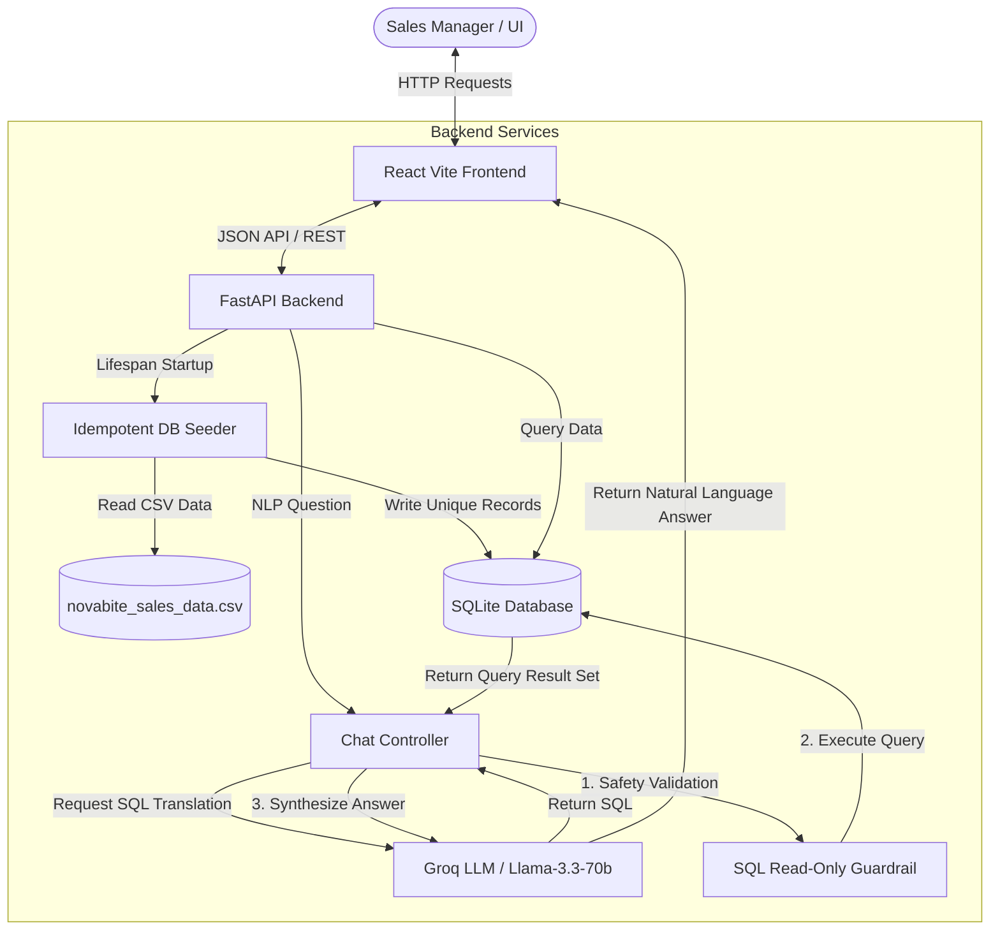

# RevMind AI — Full-Stack Take-Home Assignment

Welcome to the **NovaBite Consumer Goods Sales Insights** application. This repository contains a complete, production-ready, full-stack business intelligence platform consisting of a FastAPI backend, a React (Vite) frontend, and an integrated Conversational AI Chatbot designed to help sales managers query and analyze consumer sales data in real time.

---

## Table of Contents
1. [Project Overview](#project-overview)
2. [Features](#features)
3. [Tech Stack](#tech-stack)
4. [Project Architecture Overview](#project-architecture-overview)
5. [Directory Layout & Folder Descriptions](#directory-layout--folder-descriptions)
6. [API Endpoints](#api-endpoints)
7. [Environment Variables](#environment-variables)
8. [How to Run the Project Locally](#how-to-run-the-project-locally)
9. [Technical Details](#technical-details)

---

## Project Overview

NovaBite Consumer Goods Sales Insights is a platform designed to unlock transaction records and sales metrics. Rather than requiring technical expertise to write complex database queries, sales managers can consult a conversational chatbot using natural language queries to immediately receive accurate KPIs, monthly trends, regional comparisons, and rep performances.

---

## Features

- **Dynamic Interactive Dashboard:** Top-level metrics cards (Total Net Revenue, Gross Profit Margin, Top Region) along with chronological monthly sales trend visualizations.
- **Natural Language Conversational Assistant:** Translates plain English user queries (e.g., *"Which sales rep closed the most units in 2025?"*) into safe read-only SQL queries, executes them against SQLite, and synthesizes a natural, concise business-focused response.
- **Automatic Idempotent Seeding:** On backend startup, the system automatically checks for the database structure, imports the 1,000 transaction records from `novabite_sales_data.csv` if empty, and ensures no duplicate records are inserted on subsequent restarts.
- **Robust Security Guardrails:** Includes a query validation pipeline preventing SQL injection and data mutation operations by strictly validating that all generated queries are read-only `SELECT` statements.
- **Unified Logging System:** Uses Python's native logging framework, fully integrated with FastAPI/Uvicorn, logging server status, database actions, and seeding details.

---

## Tech Stack

### Backend
- **FastAPI:** High-performance, modern Python web framework.
- **SQLAlchemy 2.0:** Object-relational mapping and database engine interactions.
- **SQLite:** Lightweight, serverless, file-based relational database.
- **Pandas:** Used for efficient CSV parsing and seeding operations.
- **Groq SDK (OpenAI-compatible):** Powers the LLM integrations for Text-to-SQL generation and insights synthesis.

### Frontend
- **React (Vite):** A modern UI rendering structure providing hot module replacement.
- **Recharts / Chart.js:** Clean, interactive data visualization library for charting trend data.
- **Vanilla CSS:** Custom tailored CSS for modern styling, transitions, and responsive grid layouts.

---

## Project Architecture Overview



---

## Directory Layout & Folder Descriptions

```
├── backend/                  # Python FastAPI Backend
│   ├── app/                  # Main FastAPI Application Directory
│   │   ├── api/              # API Route Controllers (health, analytics, chat)
│   │   ├── core/             # Configuration Settings & Database Connections
│   │   ├── middleware/       # Global Error Handling & Validation Middlewares
│   │   ├── models/           # SQLAlchemy Declarative Models (sales)
│   │   └── services/         # Core Services (LLM Chat Pipeline Logic)
│   ├── main.py               # Backend Dev Server Entry Point
│   ├── requirements.txt      # Python Backend Dependencies
│   ├── .env.example          # Backend Environment Template
│   └── seed.py               # Idempotent DB Seeder Module
├── frontend/                 # React Frontend
│   ├── src/                  # Main React Source Directory
│   │   ├── components/       # Reusable UI Elements (Cards, Charts)
│   │   ├── services/         # API Service Integrations (Analytics, Chat)
│   │   ├── App.jsx           # Main Dashboard and Chat View Wrapper
│   │   └── main.jsx          # Frontend Client Entry Point
│   ├── package.json          # Node.js Project Dependencies
│   └── .env.example          # Frontend Environment Template
├── data/
│   └── novabite_sales_data.csv # Raw transactional dataset (1,000 rows)
└── README.md
```

---

## API Endpoints

| Method | Route | Tags | Description |
|---|---|---|---|
| `GET` | `/health` | `health` | Check backend service state and database connection health. |
| `GET` | `/api/summary` | `analytics` | Return top KPIs: Net Revenue, Total Units, Gross Profit Margin %, Top Region, Top Channel, Top Product. |
| `GET` | `/api/products` | `analytics` | Return distinct products aggregated with net revenue and units sold (sorted by revenue descending). |
| `GET` | `/api/trends` / `/api/monthly-trend` | `analytics` | Return chronological monthly sales aggregated by month (net revenue, units sold, gross profit). |
| `GET` | `/api/sales-by-region` | `analytics` | Get regional sales aggregates, gross profit, and margin % statistics. |
| `GET` | `/api/sales-by-category` | `analytics` | Get category sales aggregates, units, gross profit, and margin %. |
| `GET` | `/api/top-products` | `analytics` | Fetch top-performing products by net revenue with a query `limit` parameter. |
| `GET` | `/api/profit-analysis` | `analytics` | Fetch detailed profit metrics partitioned by Category, Subcategory, and Channel. |
| `POST` | `/api/chat` | `chat` | Accepts `{ "question": "..." }` user query and returns LLM-synthesized response. |

---

## Environment Variables

### Backend Configuration (`backend/.env`)
- `GROQ_API_KEY`: API authentication key for Groq Cloud. (Required for chatbot features).
- `DATABASE_URL`: The SQLite database connection URI. (Default: `sqlite:///./sales_insights.db`).
- `PORT`: Port number the backend server runs on. (Default: `8000`).
- `DEBUG`: Boolean flag to run the application in debug mode. (Default: `true`).
- `ENVIRONMENT`: Application environment context. (Default: `development`).

### Frontend Configuration (`frontend/.env`)
- `VITE_API_BASE_URL`: The base URL pointing to the running backend service. (Default: `http://localhost:8000`).

---

## How to Run the Project Locally

### 1. Prerequisites
- Python 3.10+
- Node.js 18+ (npm or yarn)

### 2. Backend Setup
1. Navigate to the backend directory:
   ```bash
   cd backend
   ```
2. Create and activate a virtual environment:
   ```bash
   python -m venv venv
   # On Windows (PowerShell):
   .\venv\Scripts\Activate.ps1
   # On macOS/Linux:
   source venv/bin/activate
   ```
3. Install dependencies:
   ```bash
   pip install -r requirements.txt
   ```
4. Copy the `.env.example` to `.env` and fill in your API keys:
   ```bash
   cp .env.example .env
   ```
5. Run the FastAPI development server:
   ```bash
   uvicorn main:app --reload
   ```
   The API will be available at `http://127.0.0.1:8000`. You can view interactive Swagger documentation at `http://127.0.0.1:8000/docs`.

### 3. Frontend Setup
1. Navigate to the frontend directory:
   ```bash
   cd frontend
   ```
2. Install dependencies:
   ```bash
   npm install
   ```
3. Start the Vite development server:
   ```bash
   npm run dev
   ```
   The frontend will be available at `http://localhost:5173`.

---

## Technical Details

### 1. LLM Selection
- **Model Used:** `llama-3.3-70b-versatile` hosted on Groq Cloud.
- **Rationale:** Selected for its state-of-the-art text-to-SQL capabilities, fast inference times, and high accuracy in mapping complex natural language questions into SQLite-specific queries. Groq's API provides OpenAI SDK compatibility, allowing for low-latency JSON completions without heavy local computation.

### 2. Prompt Engineering
- **SQL Generation Prompt:** Translates user questions into SQLite SELECT queries. It includes database schema definitions (column names, types, allowed categorical values) and general database statistics to help the LLM perform correct aggregates and dates matching. It strictly instructs the model to only output raw SQL query text.
- **Business Synthesis Prompt:** Feeds the original user question, the generated SQL query, and the exact query results from SQLite back to the LLM. It directs the model to summarize the information in a concise, analyst-style response, formatting currencies in USD and margins as percentages.

### 3. Areas of Improvement
- **Query Cache Layer:** Integrate Redis or memory-based caching (LRU) for common BI requests to reduce redundant database queries and LLM API costs.
- **Conversation State/Memory:** Implement user session tokens to support follow-up conversational turns (e.g. *"How did that compare to Q2?"*).
- **Comprehensive Test Suite:** Implement unit and integration tests for route behaviors and LLM mock prompts using `pytest`.
- **Database Migration Framework:** Integrate Alembic to manage database schema updates.

### 4. Tradeoffs & Shortcuts
- **File-Based SQL Database:** SQLite is used as a lightweight database suitable for local deployment, rather than hosting a production-grade PostgreSQL instance.
- **Safety Validation:** Raw string keyword matches are used to validate SQL safety (e.g., rejecting queries containing `DROP`, `UPDATE`, `INSERT`) rather than a full AST SQL parsing engine (e.g., `sqlparse`), which would be more robust against complex injection attempts.
