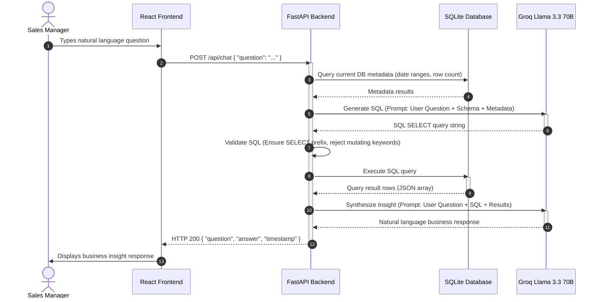

# RevMind AI — Full-Stack Take-Home Assignment

Welcome to the **NovaBite Consumer Goods Sales Insights** application. This repository contains a complete, production-ready, full-stack business intelligence platform consisting of a FastAPI backend, a React (Vite) frontend, and an integrated Conversational AI Chatbot designed to help sales managers query and analyze consumer sales data in real time.

---

## Table of Contents
1. [Project Overview](#project-overview)
2. [Features](#features)
3. [Tech Stack](#tech-stack)
4. [Text-to-SQL Architecture Overview](#text-to-sql-architecture-overview)
5. [Directory Layout & Folder Descriptions](#directory-layout--folder-descriptions)
6. [API Endpoints](#api-endpoints)
7. [Environment Variables](#environment-variables)
8. [Local Setup Instructions](#local-setup-instructions)
9. [LLM Selection](#llm-selection)
10. [Prompt Engineering Strategy](#prompt-engineering-strategy)
11. [Example Questions Supported](#example-questions-supported)
12. [Areas of Future Improvement](#areas-of-future-improvement)
13. [Tradeoffs & Shortcuts](#tradeoffs--shortcuts)

---

## Project Overview

NovaBite Consumer Goods Sales Insights is a platform designed to unlock transaction records and sales metrics. Rather than requiring technical expertise to write complex database queries, sales managers can consult a conversational chatbot using natural language queries to immediately receive accurate KPIs, monthly trends, regional comparisons, and rep performances.

---

## Features

- **Dynamic Interactive Dashboard:** Top-level metrics cards (Total Net Revenue, Gross Profit Margin, Top Region) along with chronological monthly sales trend visualizations.
- **Natural Language Conversational Assistant:** Translates plain English user queries (e.g., *"Which sales rep closed the most units in 2025?"*) into safe read-only SQL queries, executes them against SQLite, and synthesizes a natural, concise business-focused response.
- **Automatic Idempotent Seeding:** On backend startup, the system automatically checks for the database structure, imports the 1,000 transaction records from `novabite_sales_data.csv` if empty, and ensures no duplicate records are inserted on subsequent restarts.
- **Robust Security Guardrails:** Includes a query validation pipeline preventing SQL injection and data mutation operations by strictly validating that all generated queries are read-only `SELECT` statements.
- **Unified Logging System:** Uses Python's native logging framework, fully integrated with FastAPI/Uvicorn, logging server status, database actions, and seeding details.

---

## Tech Stack

### Backend
- **FastAPI:** High-performance, modern Python web framework.
- **SQLAlchemy 2.0:** Object-relational mapping and database engine interactions.
- **SQLite:** Lightweight, serverless, file-based relational database.
- **Pandas:** Used for efficient CSV parsing and seeding operations.
- **Groq SDK (OpenAI-compatible):** Powers the LLM integrations for Text-to-SQL generation and insights synthesis.

### Frontend
- **React (Vite):** A modern UI rendering structure providing hot module replacement.
- **Recharts / Chart.js:** Clean, interactive data visualization library for charting trend data.
- **Vanilla CSS:** Custom tailored CSS for modern styling, transitions, and responsive grid layouts.

---

## Text-to-SQL Architecture Overview

The Conversational Insights Chatbot is powered by a robust three-phase Text-to-SQL pipeline designed to safely translate, validate, execute, and summarize relational data queries.



### Detailed Pipeline Stages:
1. **Context Harvesting:** The backend dynamically retrieves the table schema definition and performs a lightweight query against the SQLite database to gather high-level baseline statistics (row count, min/max transaction dates, overall sales volumes).
2. **Text-to-SQL Translation:** The user question, table schema, and database baseline statistics are compiled into a highly detailed system prompt and sent to the LLM to generate a single, target SQLite database query.
3. **Safety Guardrail Inspection:** Before hitting the database, the query string is programmatically audited. It must start with a `SELECT` statement and contain no mutating SQL commands (e.g. `INSERT`, `DROP`, `DELETE`, `UPDATE`).
4. **Data Retrieval:** The safe SQL statement is executed via SQLAlchemy, fetching raw rows and mapping them to a JSON-ready list of dictionaries.
5. **Insights Synthesis:** The LLM receives the original question, the executed SQL query, and the exact query results to formulate a concise business answer.

---

## Directory Layout & Folder Descriptions

```
├── backend/                  # Python FastAPI Backend
│   ├── app/                  # Main FastAPI Application Directory
│   │   ├── api/              # API Route Controllers (health, analytics, chat)
│   │   ├── core/             # Configuration Settings & Database Connections
│   │   ├── middleware/       # Global Error Handling & Validation Middlewares
│   │   ├── models/           # SQLAlchemy Declarative Models (sales)
│   │   └── services/         # Core Services (LLM Chat Pipeline Logic)
│   ├── main.py               # Backend Dev Server Entry Point
│   ├── requirements.txt      # Python Backend Dependencies
│   ├── .env.example          # Backend Environment Template
│   └── seed.py               # Idempotent DB Seeder Module
├── frontend/                 # React Frontend
│   ├── src/                  # Main React Source Directory
│   │   ├── components/       # Reusable UI Elements (Cards, Charts)
│   │   ├── services/         # API Service Integrations (Analytics, Chat)
│   │   ├── App.jsx           # Main Dashboard and Chat View Wrapper
│   │   └── main.jsx          # Frontend Client Entry Point
│   ├── package.json          # Node.js Project Dependencies
│   └── .env.example          # Frontend Environment Template
├── data/
│   └── novabite_sales_data.csv # Raw transactional dataset (1,000 rows)
└── README.md
```

---

## API Endpoints

| Method | Route | Tags | Description |
|---|---|---|---|
| `GET` | `/health` | `health` | Check backend service state and database connection health. |
| `GET` | `/api/summary` | `analytics` | Return top KPIs: Net Revenue, Total Units, Gross Profit Margin %, Top Region, Top Channel, Top Product. |
| `GET` | `/api/products` | `analytics` | Return distinct products aggregated with net revenue and units sold (sorted by revenue descending). |
| `GET` | `/api/trends` / `/api/monthly-trend` | `analytics` | Return chronological monthly sales aggregated by month (net revenue, units sold, gross profit). |
| `GET` | `/api/sales-by-region` | `analytics` | Get regional sales aggregates, gross profit, and margin % statistics. |
| `GET` | `/api/sales-by-category` | `analytics` | Get category sales aggregates, units, gross profit, and margin %. |
| `GET` | `/api/top-products` | `analytics` | Fetch top-performing products by net revenue with a query `limit` parameter. |
| `GET` | `/api/profit-analysis` | `analytics` | Fetch detailed profit metrics partitioned by Category, Subcategory, and Channel. |
| `POST` | `/api/chat` | `chat` | Accepts `{ "question": "..." }` user query and returns LLM-synthesized response. |

---

## Environment Variables

### Backend Configuration (`backend/.env`)
- `GROQ_API_KEY`: API authentication key for Groq Cloud. (Required for chatbot features).
- `DATABASE_URL`: The SQLite database connection URI. (Default: `sqlite:///./sales_insights.db`).
- `PORT`: Port number the backend server runs on. (Default: `8000`).
- `DEBUG`: Boolean flag to run the application in debug mode. (Default: `true`).
- `ENVIRONMENT`: Application environment context. (Default: `development`).

### Frontend Configuration (`frontend/.env`)
- `VITE_API_BASE_URL`: The base URL pointing to the running backend service. (Default: `http://localhost:8000`).

---

## Local Setup Instructions

Follow these step-by-step instructions to set up, seed, and run the project locally.

### 1. Prerequisites
- Python 3.10+
- Node.js 18+ (npm or yarn)
- A Groq Cloud API Key (Get one free from [Groq Console](https://console.groq.com/))

### 2. Environment Setup
Create environment configuration files for both the backend and frontend.

- **Backend:** Copy `backend/.env.example` to `backend/.env` and insert your API credentials:
  ```bash
  cp backend/.env.example backend/.env
  ```
  Open the file and configure:
  ```env
  GROQ_API_KEY=your-actual-groq-api-key-here
  DATABASE_URL=sqlite:///./sales_insights.db
  PORT=8000
  DEBUG=true
  ```

- **Frontend:** Copy `frontend/.env.example` to `frontend/.env`:
  ```bash
  cp frontend/.env.example frontend/.env
  ```
  Open the file and configure:
  ```env
  VITE_API_BASE_URL=http://localhost:8000
  ```

### 3. Backend Installation & Database Seeding
1. Navigate to the backend directory:
   ```bash
   cd backend
   ```
2. Create and activate a Python virtual environment:
   ```bash
   python -m venv venv
   # On Windows (PowerShell):
   .\venv\Scripts\Activate.ps1
   # On macOS/Linux:
   source venv/bin/activate
   ```
3. Install the required Python dependencies:
   ```bash
   pip install -r requirements.txt
   ```
4. **Database Seeding:**
   - **Automatic Seeding (Recommended):** The SQLite database seeder is fully integrated into the FastAPI server lifespan. Simply starting the server will automatically create the database structure, verify table status, parse `novabite_sales_data.csv`, and seed it.
   - **Manual Seeding (Optional CLI Command):** If you prefer to seed the database prior to starting the web server, run the standalone seeding command:
     ```bash
     python seed.py
     ```
     *Note: This command runs in a fully backward-compatible mode, verifying constraints and logging statistics directly to standard output.*

### 4. Running the Application
1. **Start the Backend Server:**
   From the active virtual environment in the `backend/` directory, run:
   ```bash
   uvicorn main:app --reload
   ```
   *The API will boot and output the following seeding logs upon startup:*
   ```text
   INFO:     Started server process [15268]
   INFO:     Waiting for application startup.
   INFO:     Startup seeding started
   INFO:     Database tables verified/created successfully.
   INFO:     Loaded CSV file: 1000 records found.
   INFO:     Number of records inserted: 1000
   INFO:     Seeding completed
   INFO:     Application startup complete.
   INFO:     Uvicorn running on http://127.0.0.1:8000 (Press CTRL+C to quit)
   ```
   On subsequent server restarts, the seeder validates that records already exist, ensuring idempotency:
   ```text
   INFO:     Startup seeding started
   INFO:     Database tables verified/created successfully.
   INFO:     Loaded CSV file: 1000 records found.
   INFO:     Database already seeded
   INFO:     Seeding completed
   INFO:     Application startup complete.
   ```
   *You can access backend Swagger docs at http://127.0.0.1:8000/docs.*

2. **Start the Frontend UI:**
   Open a new terminal window, navigate to the frontend directory, install node modules, and boot the server:
   ```bash
   cd frontend
   npm install
   npm run dev
   ```
   *Open your browser and navigate to http://localhost:5173 to access the dashboard and chatbot UI.*

---

## LLM Selection

### Choice: Llama 3.3 70B Versatile on Groq Cloud
For translating natural language queries into executable database code and drafting business summaries, we utilize the **Llama 3.3 70B Versatile** model (`llama-3.3-70b-versatile`) accessed via Groq Cloud API.

### Key Factors for LLM Selection:
1. **Sub-Second Latency:** Utilizing Groq's specialized LPU (Language Processing Unit) architecture enables token generation speeds multiple times faster than standard hosting platforms. This allows the backend to perform Text-to-SQL generation and response synthesis sequentially in less than 1.5 seconds.
2. **Text-to-SQL Query Accuracy:** The 70B parameter model is highly proficient at logical reasoning, schema matching, date manipulation, and writing complex database statements (e.g. nested SELECT queries, group-by constraints, and SQL type casting).
3. **OpenAI-Compatible SDK Interface:** The Groq SDK interfaces seamlessly with standard OpenAI Python wrappers, allowing clean and standard system/user prompt definitions.
4. **Cost and Resource Efficiency:** Groq offers generous free-tier API endpoints, removing the need for local GPU hosting.

---

## Prompt Engineering Strategy

The application features a tailored prompt engineering strategy divided into clear data-harvesting and execution phases:

### 1. Schema Context
Rather than leaving the model to guess database columns, a detailed database schema context is injected into the SQL Generation System Prompt:
- Explains primary keys (`transaction_id`).
- Outlines string-stored dates and chronological month formats (`date` as `YYYY-MM-DD`, `month` as `YYYY-MM`).
- Lists exact strings for categorical columns (`category` as 'Personal Care', 'Snacks', etc.; `region` as 'North', 'South', etc.).
- Describes derived metrics formulas (e.g., `gross_profit_usd` is `net_revenue_usd` - `cogs_usd`).

### 2. Database Summary Context
To prevent the model from querying invalid parameters (such as years or products outside our dataset boundary), the system runs a fast aggregate query against SQLite at startup. The results are formatted as:
```text
Current Database General Statistics:
- Total Sales Transactions: 1000
- Sales Date Range: 2024-01-02 to 2025-12-31
- Total Net Revenue: $1,475,342.12
- Total Units Sold: 312,450
- Average Gross Profit Margin: 54.12%
```
This is appended to the system instructions, ensuring the LLM is anchored to our real data envelope.

### 3. SQL Generation
The generation prompt instructs the model to translate plain English into standard SQLite queries:
- Restricts outputs strictly to raw SQL query text.
- Rejects any conversational preamble or markdown formatting wrapper.
- Details calculations for compound metrics (e.g. Gross Profit Margin % calculated as `(SUM(gross_profit_usd) / SUM(net_revenue_usd)) * 100`).

### 4. SQL Validation (Programmatic Guardrail)
To guarantee the system is safe from malicious SQL injections or accidental data deletions, the generated query is checked:
```python
# Cleaning wrappers and markdown codes
sql = clean_sql_query(llm_response)

# Enforcing read-only prefix and blocking mutating keywords
if not sql.strip().lower().startswith("select"):
    raise ValueError("Only read-only SELECT database queries are permitted.")
```
Any queries containing blocked words (e.g. `DROP`, `DELETE`, `UPDATE`, `INSERT`, `ALTER`) are immediately aborted, returning a 400 Bad Request exception.

### 5. Insight Synthesis
Once SQLite executes the query and returns raw rows, a final prompt compiles:
- The manager's original question.
- The SQL statement that resolved it.
- The exact database response rows.
The LLM is instructed to act as a senior business intelligence analyst, stating the direct metrics in the first sentence, formatting all currencies and margins, and compiling tabular comparisons into clean markdown structures.

---

## Example Questions Supported

The Text-to-SQL chatbot dynamically translates and resolves natural language questions, including the following scenarios:

1. **"Which region had the highest net revenue in Q1 2024?"**
   - *Translation Strategy:* Filters the `quarter` column for `'Q1-2024'`, groups records by `region`, aggregates `SUM(net_revenue_usd)`, and sorts descending with a `LIMIT 1`.
2. **"What is the gross profit margin for the Snacks category?"**
   - *Translation Strategy:* Filters the `category` column for `'Snacks'`, and calculates the cumulative margin: `(SUM(gross_profit_usd) / SUM(net_revenue_usd)) * 100`.
3. **"Which sales rep closed the most units in 2025?"**
   - *Translation Strategy:* Filters dates where `month LIKE '2025-%'`, groups by `sales_rep`, sums the `units_sold`, and returns the top rep.
4. **"Compare E-Commerce vs Modern Trade net revenue."**
   - *Translation Strategy:* Selects `channel` and `SUM(net_revenue_usd)`, filtering specifically for channels in `('E-Commerce', 'Modern Trade')`, grouping by `channel`.
5. **"What was the best performing product in the West region?"**
   - *Translation Strategy:* Filters `region = 'West'`, groups transactions by `product_name`, aggregates `SUM(net_revenue_usd)` and sorts descending with `LIMIT 1`.

---

## Areas of Future Improvement

- **Query Cache Layer:** Integrate Redis or memory-based caching (LRU) for common BI requests to reduce redundant database queries and LLM API costs.
- **Conversation State/Memory:** Implement user session tokens to support follow-up conversational turns (e.g. *"How did that compare to Q2?"*).
- **Comprehensive Test Suite:** Implement unit and integration tests for route behaviors and LLM mock prompts using `pytest`.
- **Database Migration Framework:** Integrate Alembic to manage database schema updates.

---

## Tradeoffs & Shortcuts

- **File-Based SQL Database:** SQLite is used as a lightweight database suitable for local deployment, rather than hosting a production-grade PostgreSQL instance.
- **Safety Validation:** Raw string keyword matches are used to validate SQL safety (e.g., rejecting queries containing `DROP`, `UPDATE`, `INSERT`) rather than a full AST SQL parsing engine (e.g., `sqlparse`), which would be more robust against complex injection attempts.
